## Introduction

### Key Points for ERP Implementation

1. Map ERP features to customer needs and best practices.
2. Standardize and reuse solutions.
3. Set priorities.
4. Handle user concerns diplomatically.
5. Integrate or migrate data when possible.
6. Refer to SRS (Software Requirement Specification) as a blueprint.
7. Communicate and collaborate.

### Features & Terms

- **Zoom/Drill Down**: Double-click to open related records.
- **External Variables**: Set default field values.
- **UD Parameter**: User-defined parameters in procedures.
- **Design Control**: Customize form objects globally or locally.
- **Report Engine**: Central report management, access controlled.
- **Attachments**: Add images or text to documents.
- **Alert Engine**: Set reminders.
- **Company Parameter**: Store company info and file paths.
- **Grid Layout Settings**: Adjust grid layouts per user.
- **Multi-select XML for USP**: Pass multiple selections as XML to procedures.

### FACTS Concepts

- Documents are the building blocks.
- Primary keys: FYCODE, DOCTYPE, DOCNO, DOCSRNO.
- List/grid forms.
- User master definition.
- Area code example: ACMST_AREA_CODE (e.g., DXB).

### Customization Levels

- RnD layer
- Industry vertical
- Customer-specific

### ERP Verticals & Versions

FactsERP has 10 different versions, catering for 3 different business verticals as below.

1.  Trading Vertical
    1. Bulk Inventory (General Trading with Weighted Average Costing method)
    2. Batch controlled Inventory (Spare-parts)
    3. Consignment Sale & Purchase (for Fruit and Vegetable wholesale)
    4. Serial number Controlled (Electronic goods, for warranty tracking)
    5. Piecewise (Roll-wise) controlled (Textiles, Furnishing Fabrics etc.)
    6. Retail/ Point of Sales
2.  Manufacturing Vertical
    1. Discrete Manufacturing (Batch-wise/ Made to Order)
    2. Continues Manufacturing (On Production Order)
3.  Service Vertical
    1. Civil Contracting
    2. Job Costing
       - Electro Mechanical Contracting
       - Service companies like ours
       - Workshops
       - Steel Fabrication Companies

### Important Stock Tables

- **stock_master**  
   Main table for stock items.

- **stock_location_master**  
   Stores information about stock locations.

- **stock_batch_master**  
   Manages batch details for stock items.

- **stock_piece_master**  
   Handles individual piece details.

- **stock_transaction** -> _trigger_
  Updates the following tables during transactions:

  - stock_master
  - stock_location_master
  - stock_batch_master

- **stock_piece_fl_transaction**  
   Updates the following tables if there is stock/inventory updation:
  - stock_piece_transaction -> [trigger]
  - stock_piece_master

### ERP Functionality

- **Data Collection**: Gather data as it happens.
- **Data Posting**: Process data for information.
- **Reporting**: Use Grid Tool for filtering, sorting, grouping.

Here is a simplified and easy-to-understand version of the **Installation / Company Parameters** content, along with a Mermaid diagram to help visualize the structure:

## Installation Parameters / Company Parameters

### Installation Parameter

This section contains all the global settings and predefined parameters for each module in the ERP system. These settings control how the entire system works. For example:

- If you choose the Inventory valuation method (Perpetual or Periodic), this affects how inventory is handled throughout the ERP.
- If you update the company address here, it will show up in all reports and places where the address is required.

### Module-wise Parameters Overview

| Tab Name               | Purpose                                                                                              |
| ---------------------- | ---------------------------------------------------------------------------------------------------- |
| **Accounts**           | Set global accounting options like the type of accounting and report logos.                          |
| **Inventory**          | Set inventory parameters such as valuation method (Periodic or Perpetual), quantity display, etc.    |
| **Dates**              | Define important system dates like financial year, opening and closing dates, and date format.       |
| **Default**            | Set default system values like currency, decimal points, locations, etc.                             |
| **Keyboard Shortcuts** | Define and view all keyboard shortcuts used in the system.                                           |
| **Enquiry Options**    | Configure settings for online enquiry screens (e.g., stock, accounts) and which enquiry tabs appear. |
| **Address**            | Define the default company address used across reports and documents.                                |
| **Data Entry Options** | Configure data entry rules and document attachment settings.                                         |
| **HR & Payroll**       | Update HR-related parameters like working days, holidays, overtime details, etc.                     |
| **Signoff**            | Manage signoff names and details shown in reports. You can also add more signoff sections.           |

## Introduction to List Views

When you open a document in FactsERP, the first thing you see is the **List View**. This shows all rows and columns related to the document, representing data in an organized way.

### What is Data vs Information?

- **Data:** Raw, unorganized facts (e.g., numbers, dates) — not very useful alone.
- **Information:** Data that is processed and organized to be meaningful and helpful.

### Refresh Lists in Documents

- Each document can have one or more **refresh lists**, which are custom views showing data using stored procedures.
- These are set up in the **Miscellaneous** tab under **Document refresh list**.
- User-defined procedures control what data appears, with options like sorting, filtering, and applying user/role permissions.

### User Defined Procedure List Key Points

- **Document Number:** Unique ID for each list.
- **Procedure Name:** The function or query that retrieves data.
- **Description:** To understand list’s purpose.
- **Sort Order:** Sequence of how lists appear.
- **Filter Condition:** To reuse procedures with different filters instead of writing new ones.
- **Separator:** Option to add a visual divider between lists.
- **Roles/Users:** Control who can see or use a list.
- **Default:** Marks the default list view for a document.

### Visualization: List Views Overview

### Common List Views in Sales Invoice (Example)

- **All:** Shows all records.
- **Active:** Active documents.
- **Pending for Approval:** Documents waiting for approval or posting.
- **Pending for Re-approval:** Documents needing re-approval after cancellation.
- **Outstanding:** Invoices or orders outstanding (not settled).

Using list views helps users track important documents easily without navigating multiple reports or screens.

### Types of Lists and What They Show

| List Type                 | Description                                                                            |
| ------------------------- | -------------------------------------------------------------------------------------- |
| **Open / Pending**        | Shows header info filtered by status or business rules to focus on critical documents. |
| **Pending Line Items**    | Line items still pending completion or delivery.                                       |
| **All Records**           | Top N recent records, with date formatting for easy reference.                         |
| **Line Item Details**     | Shows detailed item info per document (location, quantity, etc.).                      |
| **Financial Allocation**  | Shows related financial documents and settlements.                                     |
| **Accounting Journals**   | Displays credit/debit accounting entries linked to the document.                       |
| **Follow-up Notes**       | Summarizes follow-ups related to the transaction or client.                            |
| **Attachments**           | Displays linked documents or files attached to the main document.                      |
| **User Action Log**       | Records of actions by users on the document, sortable by creation/modification order.  |
| **Milestones**            | Significant stages or events the document passes through.                              |
| **Pending to Approve**    | Documents created but still not approved or posted.                                    |
| **Pending to Re-approve** | Documents needing re-approval after an approval cancellation.                          |

### Recommended Columns for List Views Grid

- Counts: e.g., #F (follow-ups), #A (attachments)
- Date-related info: Last follow-up, next follow-up, days-to-go (D2G), days-before (DB4)
- User info: Created by (maker), Posted by (checker)
- Document status: Show current status including VOID
- Revision number (if applicable)
- Sortable and filterable columns with grouping and quick filters

### Attachments & Related Features

- Follow-up notes (shortcut: Shift+Ctrl+F)
- Milestones (Shift+Ctrl+M)
- Attachments (Shift+Ctrl+A)
- Document status changes & active/inactive toggles
- Scan & attach documents directly
- Receipt acknowledgements
- Workflow approvals (optional)

### Recommended Results Lists

- Document properties
- Accounting entries & related financial docs
- Profitability (document and line item-wise)
- Document relationship maps
- Stock availability and cost roll-ups
- Price comparisons and cost sheets

### Changing Document Status Example (Sales Order)

1. Double-click the document.
2. Go to **Attachments** → **Change Document Status**.
3. Set status as Active or Inactive.
4. Inactive documents won’t appear in open/pending lists.
5. Use **System Integrity Check** to update header status and refresh list appearance.

### Example Grid Columns for Sales Invoice List View

| Column Name         | Description                  |
| ------------------- | ---------------------------- |
| SO#                 | Sales Order number           |
| SO Date             | Date of Sales Order          |
| SQ#                 | Sales Quotation number       |
| B4D                 | Days before today            |
| Party Code          | Customer code                |
| Party Name          | Customer name                |
| Salesman            | Salesman name                |
| AED Net Amount      | Net amount in local currency |
| Currency            | Currency code (e.g., AED)    |
| FCY Gross Amount    | Amount in foreign currency   |
| FCY Discount Amount | Discount in foreign currency |
| Document Status     | Current status of document   |
| Remarks             | Notes on items               |
| A#                  | Number of attachments        |
| Created by (maker)  | Creator name                 |
| Created TS          | Creation timestamp           |
| Posted by (checker) | User who posted the document |

Sorting, filtering, grouping, and showing top N records are all available for easy navigation.

## Guide Lines for Data Preparation in MS Excel

### Flow chart depicting steps in data migration process

### Staging Table and Data Migration

The **Staging Table** is a temporary table used to hold data just before migrating it from the source to the target tables. Data in the staging table is processed, cleaned, and deduplicated before loading to target tables like Employee Master, Designation Master, etc.

### Purpose of Using USP's (Unique Stored Procedures):

1. **Source Duplication**: Remove duplicate data in the staging table (also called De-Duping).
2. **Destination Duplication**: Avoid inserting data already present in the destination table.
3. **Mapping**: Map columns correctly between source and target tables.

### Data Flow Simplified:

## Common Formatting Issues in Microsoft Excel

### Known Issues & Solutions:

| Field Type | Issue Description                                                  | Solution Summary                                                                                                                                           |
| ---------- | ------------------------------------------------------------------ | ---------------------------------------------------------------------------------------------------------------------------------------------------------- |
| **Number** | Exponential format for large numbers (`E` notation)                | Change cell format to Text                                                                                                                                 |
|            | Numbers beginning with zero (e.g., phone numbers)                  | Format cells as Text & prefix with a single quote `'`                                                                                                      |
| **Comma**  | Comma and decimal separator confusion (US vs European style)       | Change Windows regional settings or use Excel SUBSTITUTE formula                                                                                           |
|            | Formula to switch commas and points in numbers                     | Use the formula `=SUBSTITUTE(SUBSTITUTE(SUBSTITUTE(TEXT(A1,"$#,##0.00"),".","^"),",","."),"^",",")` that converts numbers to text with replaced separators |
|            | Leave numbers as numbers using custom format                       | Multiply values by 100 and apply a custom number format allowing up to `9.999.999,00`. Adjust format or value for decimals beyond two places               |
| **Text**   | Numbers stored as text cause sort/calculation issues               | Convert text to numbers or preserve as text via formatting                                                                                                 |
| **Date**   | Dates auto-formatting or misinterpretation (e.g., `2/2` → `2-Feb`) | Change regional date format, or reformat using Text to Columns                                                                                             |

### Cleaning-up the Data / Data Preparation (Excel to SQL Migration)

Follow these steps carefully to prepare data in Excel before migrating it to the SQL database:

1. **Enable File Extensions**  
   Show file extensions in folder options to avoid processing wrong file types.

2. **Match Template Format**  
   Ensure customer data format matches the standard template, including column headings.

3. **Avoid Merged or Blank Header Cells**  
   The top row must have column names without merged or blank cells.

4. **Unhide All Columns**  
   Select all cells and unhide any hidden columns.

5. **Add Serial Number Column**  
   Add a new column named `Sr#` and fill it with a continuous number sequence (1, 2, 3...) to revert sorting if needed.

6. **Rename First Column**  
   Rename "Employee ID / Code" to a clean name like "Employee ID" or "Customer/Supplier".

7. **Format Numeric Fields**  
   Ensure all numeric fields are formatted as numbers (not text).

8. **Fix Zero-Prefixed Columns**  
   For numbers starting with zero (e.g., phone numbers), change the format to Text.

9. **Format Date Columns**  
   Make sure all date columns are in `DD-MM-YYYY` format (e.g., 25-12-2000).  
   _Steps:_

   - Insert a new column next to the date column.
   - Copy date values into it.
   - Format this new column as `DD-MM-YYYY`.
   - Use **Data → Text To Columns** wizard, select “Delimited → Tab” and Date format as DMY.
   - Verify all values are proper dates.
   - Remove original date column if data matches.

10. **Avoid Duplicate/Misspelled Descriptions**  
    Check and correct any spelling mistakes or duplicates in description fields.

11. **Convert Relevant Fields to Text**  
    Convert fields that should be text (e.g., codes, phone numbers).

12. **Save Prepared File Correctly**

    - Save the file to the prescribed folder path (e.g., `\\db2016-srv\company shared\client\\data migration folder`).
    - Overwrite existing template file to confirm it is correct.
    - Confirm file extension is correct (usually `.xls` or `.xlsx` or `.txt` for tab delimited).

13. **Import to SQL Server**  
    Use SQL Server Import Wizard to load the prepared Excel/text file into staging tables.

### Visualization: Data Preparation Flow

### What is a Text Qualifier?

- A **Text Qualifier** is a symbol (usually a double quote `"`) used when importing data to help Excel know where text starts and ends in a delimited file.
- Especially important for comma-delimited text files to ensure fields that contain commas are read correctly.
- Set text qualifier to double quote if a column contains quoted strings to avoid field misalignment.

## Data Preparation Checklist in Excel

Before importing data from Excel to SQL, follow these steps:

1. Ensure file extensions are visible to avoid wrong files.
2. Confirm column headings match the standard template.
3. Do **not** merge or leave blank cells in the header row.
4. Unhide all columns before processing.
5. Add a serial number column (`Sr#`) for tracking order.
6. Rename columns consistently (e.g., "Employee ID" instead of "Employee ID/Code").
7. Numeric fields should be properly formatted as numbers.
8. For zero-prefixed numbers, format cells as Text and use `'` prefix.
9. Format date columns as DD-MM-YYYY; use the **Text to Columns** wizard to fix formats.
10. Remove duplicate or misspelled descriptions.
11. Convert appropriate fields as Text.
12. Save the final file as **Tab Delimited Text (.txt)** format for import.

## Text Qualifier

- A **Text Qualifier** (usually a double quote `"`) tells Excel where text begins and ends during import.
- Used when importing comma-delimited text to prevent data misalignment if fields contain commas.

---

## Data Migration Script Storage

- Scripts are stored in designated folders and views.
- Proper commenting ensures easy reuse, though migration is typically one-time.

## Merger Flow for Data Staging and Migration

## Dump Mechanisms Overview

### F2 Dump: Fetch data from Master tables (faster data entry)

- Button on FactsDetailGridManager.
- User chooses filters, loads data via stored procedure `usp_LoadDataForF2Dump`.
- Select data and fetch to populate target grid.

### F4 Dump: Fetch data from one document to another document

- Allows editing in the grid without opening detail windows.
- Maps source columns to target columns automatically, with option to customize.
- Quantity and Rate can be edited in the result window before finalizing.

### F3 Dump: Import from Excel to detail grid

- User provides Excel file path and sheet.
- Supports simple or pivoted Excel data.
- Column mapping windows allow mapping Excel columns to target grid columns.
- Options like "Combine Same Items" and "Retain Existing Data" are available.

## Dump Mechanisms Flow (Simplified)

## Customization Tools

- **Customer Layer**: Tailor the ERP system to meet specific client requirements.
- **Customization**: Modify existing features or add new ones to suit business needs.
- **Design Control**: Customize form objects globally or locally.
- **Installation changes**: Modify installation settings or parameters.
- **Stored Procedures**: Create or modify stored procedures to enhance functionality.

### Design Control Mechanism

The design control lets you change almost any part of a field.  
You can:

- Change how the field looks (formatting)
- Edit its properties
- See backend details like the database table, column names, and expression settings
- Control permissions (read, write, edit) for different users

**How to find information:**

- The database column name is shown as _`Factsfieldname`_ in the design control.
- You can also see the procedure name related to that field or list.

**How to use it:**

- Click the spanner (wrench) icon.
- Select the field you want to edit.
- The design control screen opens for that field.
- You can assign which roles or users can access or change the field.

```mermaid
flowchart TD
    A[Open Design Control 🔧] --> B[Select Field]
    B --> C{View/Edit Properties}
    C --> D[Field Formatting]
    C --> E[Backend Info: Table, Column]
    C --> F[Expression Settings]
    C --> G[Permissions: Read/Write/Edit]
    B --> H[Find Database Column Name]
    B --> I[Find Procedure Name]
    B --> J[Assign Roles/Users]
```

### Grid Layout Internals

Grid Layout is a reporting tool built into FactsERP that makes reports easier to manage and look better.  
With Grid Layout, you can:

- Change the appearance of reports
- Choose which columns to show in a report, based on data from stored procedures

FactsERP lets you save these customized grid layouts. This is linked to the “Document” concept.  
You can set custom layouts for both:

- Source Document
- Destination Document

### Facts Alert Engine Mechanism

The Facts Alert Engine automatically creates and manages alerts to keep users informed and proactive.

#### 1. Source of Alerts: Integrated & Automatic

Alerts can come from various sources:

- Data entry in documents (e.g., ETD/ETA in Purchase Orders, employee expiry date)
- Document posting or finalization triggers instant alerts
- Milestone dates in document attachments trigger alerts on those dates
- Violation of business rules (e.g., credit limit exceeded, low petty cash, reorder points)
- Scheduled alerts (e.g., daily sales report, cash receipts report)
- Local alerts created manually in the Alert Engine for adhoc needs

#### 2. Type of Alerts: Pool / Central Repository

- **Reminders:** Alert for upcoming events to prompt action before they happen  
  _Example: Visa expiry, ETA of a vessel_
- **Notifications:** Alert about recent events for information purposes  
  _Example: Bank SMS after ATM withdrawal_

#### 3. Mode of Alerts: Delivery Methods

Alerts can be delivered through:

- Integrated Dashboards in FactsERP and FactsSHARP
- SMS messages to mobile phones
- Emails to specified email addresses

## Pre-Delivery Inspection (PDI) Checklist

1. Set company parameters before install.
2. Set default reports.
3. Define document types.
4. Update document status.
5. Set print options.
6. Add document/log descriptions.
7. Avoid starting numbering with zero.
8. Maintain last document number.
9. Include all SRS documents.
10. Add chart of accounts.
11. Provide backup/report utilities.
12. Check menus for errors.
13. Create Admin and Implementation users.
14. Remove old data before new project.
15. Use standard formats.
16. Set Easy Access Menu.
17. Configure startup page for alerts.
18. Define age blocks for reports.
19. Set default balances.
20. Assign party codes for migrated PDCs.
21. Set up backend view for PDC accounts.
22. Set up sub-ledger accounts.
23. Configure divisions/departments if needed.
24. Set currency, decimals, account codes, FTP.
25. Configure consignment accounts.
26. Check row counts with `usp_DBTableRecords`.
27. Remove unused data and document types.

Submit checklist for sign-off after all checks.

## Important

- Get client sign-off before and after data migration.
